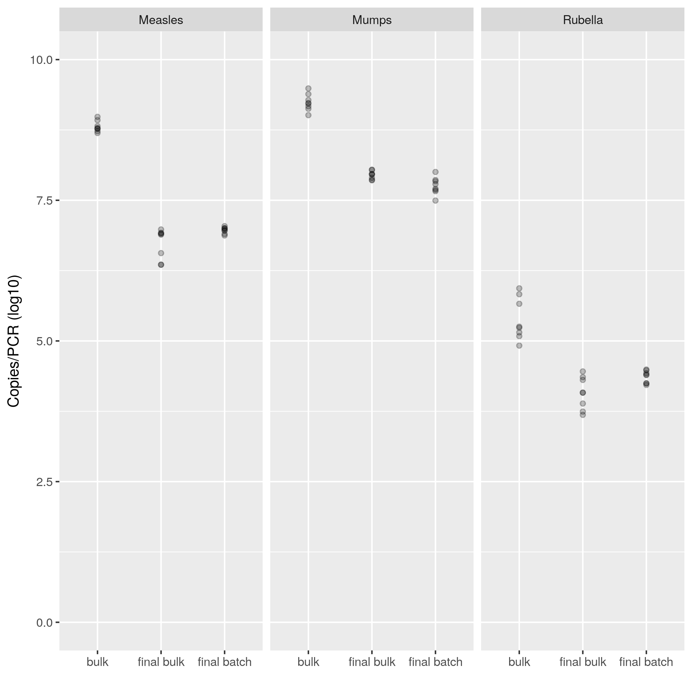

```{r setup, include=FALSE}
knitr::opts_knit$set(root.dir = "..")
library(pander)
library(philsfmisc)
```


```{r scripts, echo=FALSE}
source("scripts/modelos.R")
```

# Methods

# Results



## Mumps

The linear regression model fit for mumps data indicates that

```{r mumps-model, echo=FALSE}
pander(anova.cax,
       caption = "ANOVA table for mumps")
```

Residuals appear to be normally distributed (Shapiro-Wilk test, p = `r resid.cax.p`).

## Rubella

The linear regression model fit for rubella data indicates that

```{r rub-model, echo=FALSE}
pander(anova.rub,
       caption = "ANOVA table for rubella")
```

Residuals appear to be normally distributed (Shapiro-Wilk test, p = `r resid.rub.p`).

## Measles

The linear regression model fit for measles data indicates that

```{r measles-model, echo=FALSE}
pander(anova.sar,
       caption = "ANOVA table for Measles")
```

Residuals appear to be normally distributed (Shapiro-Wilk test, p = `r resid.sar.p`).
